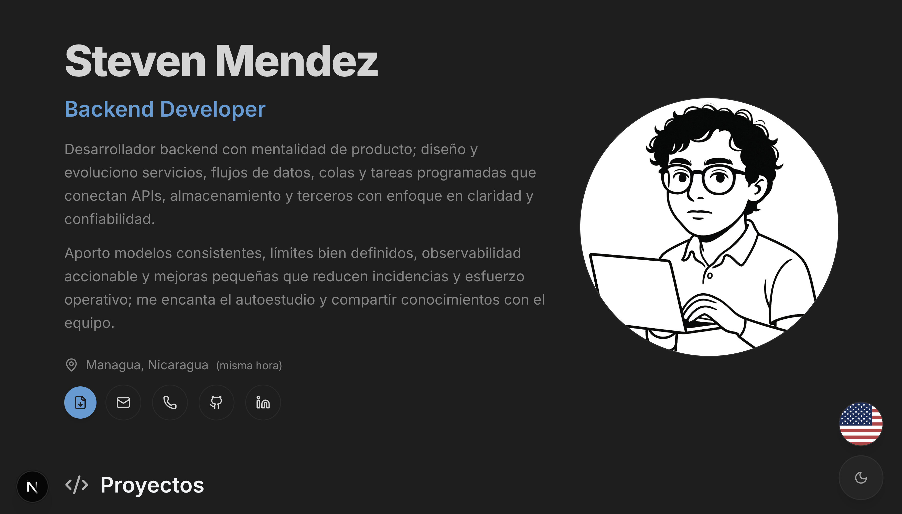

# Steven Mendez Portfolio

Modern, bilingual portfolio built with Next.js 15, TypeScript, and Tailwind CSS. It highlights professional experience, projects, and includes an AI-powered assistant that mirrors Steven's voice in English and Spanish.



**Live site:** https://steven-mendez.netlify.app/en/

## Highlights
- Full internationalization with locale-aware routing (`/en`, `/es`)
- Dark/light theming with persistent preference and system detection
- Responsive layout with animated page transitions and Radix UI primitives
- Project and experience sections backed by structured data definitions
- Chatbot powered by an OpenAI-backed hook with graceful offline fallbacks
- Deployment-ready configuration for Netlify static hosting

## Tech Stack
- Framework: Next.js 15 (App Router, static export ready)
- Language: TypeScript with strict typing
- Styling: Tailwind CSS, CSS variables, custom theming
- UI: Radix UI, shadcn/ui, Lucide icons, Framer Motion
- State & Utilities: Zustand, class-variance-authority, assistant-ui

## Getting Started
1. **Install dependencies**
   ```bash
   npm install
   ```
2. **Copy environment variables**
   ```bash
   cp env.example .env.local
   ```
3. **Run the development server**
   ```bash
   npm run dev
   ```
4. Visit `http://localhost:3000` (English) or `http://localhost:3000/es` (Spanish).

## Environment Variables
Set these in `.env.local` or your hosting provider:
- `NEXT_PUBLIC_SITE_URL` - Base URL for canonical links and meta tags.
- `OPENAI_API_KEY` - Enables live responses for the portfolio chatbot. When omitted, the UI stays functional and falls back to scripted replies.

## Available Scripts
- `npm run dev` - Start the local development server.
- `npm run build` - Create a production build.
- `npm run start` - Serve the production build.
- `npm run lint` - Run ESLint with the Next.js configuration.
- `npm run analyze` - Build with bundle analyzer enabled.
- `npm run optimize-images` - Compress assets under `public/` via `scripts/optimize-images.js`.
- `npm run export` - Generate a static export (outputs to `out/`).

## Project Structure
```
src/
  app/                Next.js entry point with locale-aware routing
  components/         Reusable UI, chatbot, layout primitives
  data/               Portfolio copy, experience, and project metadata
  hooks/              Custom hooks, including AI chat state management
  lib/                Utility helpers (system prompt selection, configs)
  types/              TypeScript interfaces shared across the app
public/               Static assets (icons, preview image, downloadable CVs)
netlify.toml          Netlify build configuration for static hosting
```

## Enabling the AI Chatbot
1. Generate an API key from OpenAI and assign it to `OPENAI_API_KEY`.
2. Redeploy or restart the dev server so the key is available at runtime.
3. The chatbot appears as a floating action button; it adapts to the current locale and acknowledges offline mode when no key is present.

## Deployment Notes
- **Netlify**: build command `npm run build`, publish directory `out/`. Set `NEXT_PUBLIC_SITE_URL` in the dashboard to your assigned domain.
- **Static hosting**: run `npm run export` and upload the generated `out/` directory to your provider of choice.

## Contact
- Email: [stevenmendezdev@gmail.com](mailto:stevenmendezdev@gmail.com)
- GitHub: [Steven-Mendez](https://github.com/Steven-Mendez)
- LinkedIn: [Steven Mendez](https://www.linkedin.com/in/steven-mendez-dev/)
